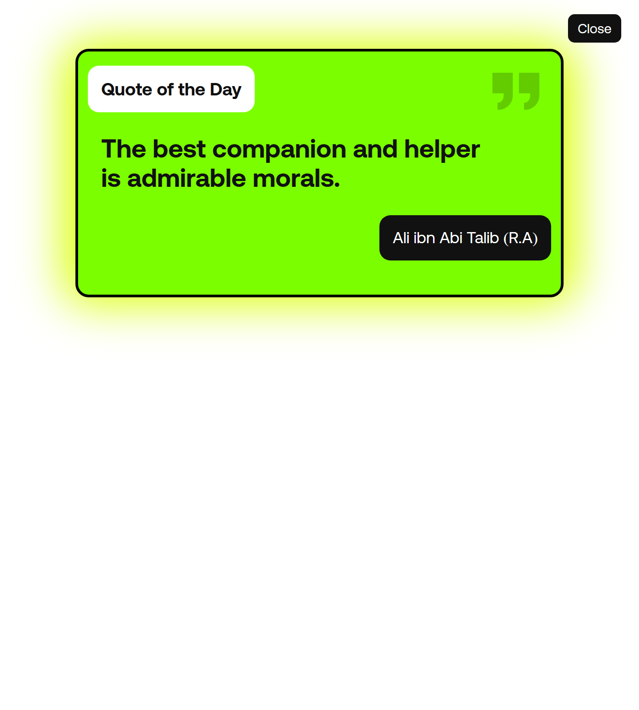

# Productivity Dashboard

Single-page productivity cockpit with to-do list, daily planner, daily goals, Pomodoro timer, motivational quotes, theme cycling, and a pluggable weather widget. Everything runs client-side and persists in `localStorage`, so it works offline after first load.



## Features
- To-Do Studio: capture tasks with focus tagging, filters (all/focus/done), progress bar, and local stats.
- Daily Planner: 6:00–24:00 timeline with inline editing, block fill counter, and “next anchor” indicator.
- Daily Goals: spotlight goal, priority chips, radial progress, momentum bars, and quick add/reset.
- Pomodoro Timer: 25/5 work-break cycles with start/pause/reset controls.
- Motivation: cached quotes from DummyJSON with fallbacks and manual refresh when the panel opens.
- Weather + Clock: live date/time and WeatherAPI current conditions (key pulled from `localStorage`).
- Theme cycling: four themes (`dark-black`, `dark-navy`, `dark-graphite`, `light`) remembered per device.

## Quick start
1) Clone or download the repo.  
2) Open `index.html` in a modern browser, or serve the folder with any static server (e.g., VS Code Live Server).

## Weather setup
The dashboard works two ways:
- **With your WeatherAPI key (preferred for accuracy):**

```js
localStorage.setItem('weatherApiKey', 'YOUR_WEATHERAPI_KEY')
localStorage.setItem('weatherCity', 'Your City')
```

Sign up for a free key at [weatherapi.com](https://www.weatherapi.com/).

- **Without a key:** it will auto-fallback to the free Open‑Meteo API using the `weatherCity` value (default: Bankura) and show “(Open-Meteo)” next to the condition.

## Data persistence
- Tasks: `localStorage.currentTask`
- Daily planner blocks: `localStorage.dayplanData`
- Daily goals: `localStorage.dailyGoalsData`
- Quotes cache: `localStorage.motivationalQuoteCache`
- Theme: `localStorage.dashboardTheme`
- Weather config: `localStorage.weatherApiKey`, `localStorage.weatherCity`

## Tech stack
- HTML, CSS, vanilla JS
- Remix Icon CDN for icons
- WeatherAPI for current conditions (user-supplied key)
- DummyJSON for motivational quotes

## Project structure
- `index.html` – markup for all panels
- `style.css` – layout, themes, and animations
- `app.js` – feature logic, localStorage, API calls
- `after-motivation-fixed.png` – preview image for the README

## License
MIT — see `LICENSE`.
